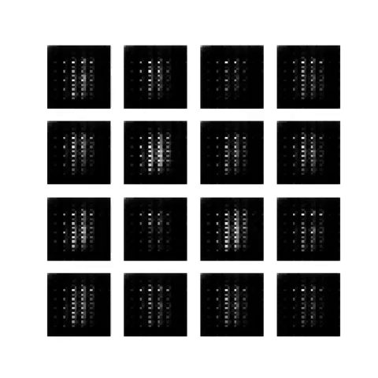

# GenerateHandwrittenDigits
Generate handwritten digits using a deep convolutional generative adversarial network (DCGAN) all while being GPU accelerated.

Instead of gathering and classifying numbers from the [MNIST dataset](http://yann.lecun.com/exdb/mnist/), this program generates
convincing handwritten MNIST numbers. As training progresses, the generator gets better at generating handwritten digits until the discriminator can no longer spot a fake image.

 

The code is written in tf.keras with eager execution enabled. Tensorflow-gpu allows us to GPU accelerate our program and reduce the
amount of time per epoch. CPU at ~95% = 200 seconds/epoch, 1080ti GPU at 20% = 8 second/epoch... Thank you cuda cores.

Credit: https://github.com/tensorflow/tensorflow/blob/r1.13/tensorflow/contrib/eager/python/examples/generative_examples/dcgan.ipynb

Language: Python 3.7.3

Packages needed: Tensorflow-gpu 1.14 | imageio 2.5.0 | matplotlib.pyplot 3.1.1 | cudatoolkit 10.0.130 | cudnn 7.6.0

Hardware needed: Nvidia GPU
